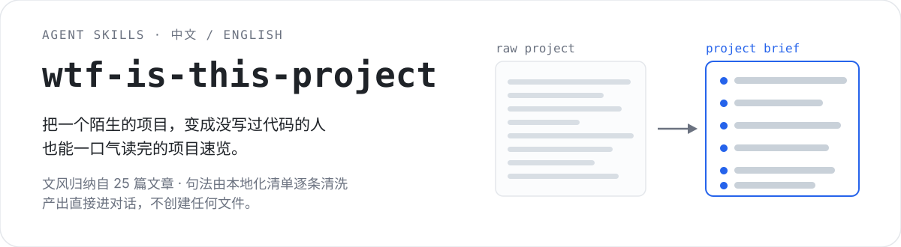
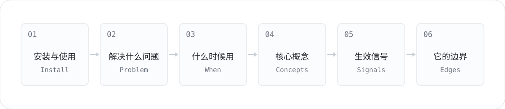

<p align="center">
  
</p>

<p align="center">
  English · two agent skills that turn any project into a beginner-readable brief.
</p>

<p align="center">
  <strong>中文</strong> · <a href="./README_en.md">English</a>
</p>

## 它解决什么问题

你丢过来一个 GitHub 项目，想知道它到底干嘛的。README 常常帮不上忙——它写给已经懂行的人看：术语不加解释，塞着安装命令和配置片段，读完还是不知道要不要用。

这个 skill 做的不是复述 README，是**重新解释**：把项目拆成六段，用没写过代码的人能懂的话重写一遍。产出直接进对话，不创建任何文件。

## 真实产出

指向 `rtk` 跑出来的开头（节选）：

> ## 🛠 怎么装上、怎么用
>
> `rtk` 站在你的 AI 编码工具和命令行之间，把命令的输出压缩之后再交给 AI。它动的是**输出**，不是命令——命令照常跑，只是递给 AI 的那一份被删掉了冗余。
>
> **装它**，三种方式任选一条：
>
> (1) `brew install rtk` —— macOS 与 Linux 上最省事
> (2) `curl -fsSL .../install.sh | sh` —— 官方脚本
> (3) `cargo install --git https://github.com/rtk-ai/rtk` —— 从源码构建
>
> **怎么用**，三步：`rtk init -g` 装上钩子 ➡️ 重启你的 AI 工具 ➡️ 照常干活，命令自动被改写。

完整样本：[中文](./wtf-is-this-project-cn/references/标杆样本.md) · [English](./wtf-is-this-project-en/references/golden-sample.md)

## 为什么不是"让 AI 总结一下"

两层规则各管一摊，互不交叉：

| 层 | 谁管 | 内容 |
|---|---|---|
| 内容与结构 | `文风规则.md` | 六段骨架 + S/W/T/N 四组约束，归纳自 Matt Pocock 团队 25 篇文章 |
| 句子措辞 | `中文句法清单.md` | 中文 AI 味 A/B/C/D 四组检查，由 humanizer 汉化而来 |

分工是硬的：**句法清单只管句子怎么措辞，文风规则只管内容与结构**。所以产出不会是"读着顺但结构松散"，也不会是"结构工整但满篇 AI 腔"。

## 六段骨架

<p align="center">
  
</p>

顺序不可换。缺内容就整段省掉——**允许缺段，不允许重排，也不允许凑数**。

两点刻意的设计：

- **安装使用排在首位。** 纯小白唯一要照着动手的就是这一段，它值得占篇幅。
- **第 5 段写"生效信号"，不写功能清单。** 回答的是"读者怎么知道它起作用了"。

## 怎么用

| 版本 | 目录 | name | 产出 |
|---|---|---|---|
| 中文 | `wtf-is-this-project-cn/` | `wtf-is-this-project` | 中文 |
| 英文 | `wtf-is-this-project-en/` | `wtf-is-this-project-en` | English |

整个目录复制到你的 skills 目录即可：

```bash
# 用户级，所有项目都能用
cp -r wtf-is-this-project-cn ~/.workbuddy/skills/

# 或项目级，只在这个仓库里生效
cp -r wtf-is-this-project-cn .workbuddy/skills/
```

然后在对话里把一个项目丢给它：

> 测试一下这个项目：https://github.com/RoseKhlifa/Image-Studio

它会先探查你的操作系统，再给对应平台的**直接下载链接**——不会回你一句"去官网下载"。

## 仓库结构

```
.
├── wtf-is-this-project-cn/        中文 skill
│   ├── SKILL.md
│   └── references/               文风规则 · 中文句法清单 · 标杆样本
├── wtf-is-this-project-en/        英文 skill
│   ├── SKILL.md
│   └── references/               style-rules · ai-flavor-checklist · golden-sample
├── assets/readme/                 本页用到的图
├── docs/adr/                      架构决策记录 0001–0005
├── .scratch/wtf-is-this-project/  spec 与 tickets（本地 issue tracker）
├── CONTEXT.md                     领域模型：术语表
└── AGENTS.md                      工程配置
```

## 两个版本不是互译

英文版有**两份参考文档比中文版更接近源头**：

- `style-rules.md` 引用的是 25 篇文章的**英文原句**——中文版是翻译过来的，英文版没有翻译漂移。
- `ai-flavor-checklist.md` 用的是 humanizer 的**英文原始 pattern**——ADR-0003 的"汉化"对英文版不成立，ADR-0002 的删减两个版本都适用。

## 设计决策

`docs/adr/` 记录了五次偏离：

| ADR | 决定 |
|---|---|
| 0001 | ~~双交付模式~~ **已废止**：HTML 模式取消，只保留对话输出 |
| 0002 | humanizer 只取句法层，删掉打乱顺序、字数 +30% 那批指令 |
| 0003 | humanizer 的英文规则必须汉化才能用于中文产出 |
| 0004 | 子 agent 并发上限 8 个 |
| 0005 | Common questions 整段删除，后改为**简写 2–3 组**回归 |

## 已知边界

- **不做多模态**：视频、音频不在范围内。
- **不查会漂移的数字**：star 数、issue 数、版本号一概不问不查不写——复核要花时间，而漂移的数字对读者没有价值。
- **不写工程状态**：bug 清单、文档自相矛盾、社区争议——纯小白看了也无从行动。
- **遇到取不到的信息会留白并说明**，不硬凑。代价是摄入会慢一点。

## License

MIT
